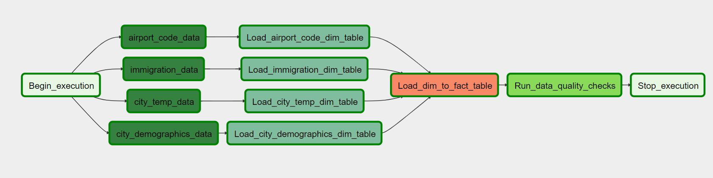

# Udacity Data Engineer Capstone Project: 
## An automated data pipeline for temperature and immigration information.

## Introduction
The project's goal is to build out an ETL pipeline with the data of city temperature, airport detail, USA cities population by gender and immigration 
statistics of different cities. First extract data from given format and converted into small chucks of Json files using Apache Spark. And then store 
all files to Amazon S3 bucket. Now load that all data into Redshift cluster's Postgres database using Apache Airflow to make fully automated this system.

## Tools and Technologies used
The tools used in this project include:
- __Apache Spark__ - This was used for convert big csv file to small chunks of json file.
- __Apache Airflow__ - This is used for making automated process in every stage like upload json file to S3, create table to upload data,performing ETL process load data into dimension and fact table.
- __Amazon Redshift__ - This is database it store data from S3 and that data add into the fact and dimension tables.
- __Amazon S3__ - It is storage system so here we stored json files which is generated by spark that are uploaded from the local filesystem.

## Datasets Used
The datasets used and sources include:
- __I94 Immigration Data__: This data is retrieved from the US National Tourism and Trade Office and the source can be found [here](https://travel.trade.gov/research/reports/i94/historical/2016.html).
- __World Temperature Data__: This dataset came from Kaggle and you can find out about it [here](https://www.kaggle.com/berkeleyearth/climate-change-earth-surface-temperature-data).
- __U.S. City Demographic Data__: This data comes from OpenSoft [here](https://public.opendatasoft.com/explore/dataset/us-cities-demographics/export/).
- __Airport Code Table__: This is a simple table of airport codes and corresponding cities that is retrieved from [here](https://datahub.io/core/airport-codes#data)

## Context
Using this data we can find answer of below questions :
- Find the average city temperature according to month and city for immigrants.
- Find the average age of immigrants at a given city of entry by gender.
- Find city population by gender.
- Find which age group people comes in which city or state mostly.
- Find most common entry point in immigrants and busiest port of entry.
- Find most common visa type used by immigrants.

## Workflow
1. First create redshift cluster on AWS Cloud.
2. Open Project file in airflow environment.
3. Fill all credential and data to `aws.cfg` file.
4. Add your AWS and Redshift credentials in the airflow UI. Follow below steps:
    - Click on the __Admin tab__ and select __Connections__.
    - Under __Connections__, select __Create__.
    - In the Create tab enter the following credentials:
        - Conn Id: `aws_credentials`
        - Conn Type: `Amazon Web Services`
        - Login: Your `<AWS Access Key ID>`
        - Password: `<Your AWS Secret Access Key>`
    - Once done, click on __Save and Add Another__
    - On the new create page add the following:
        - Conn Id: `redshift`
        - Conn Type: `Postgres`
        - Host: `<Endpointof your redshift cluster>`
        - Schema: `<Redshift database name>`
        - Login: `<Database username>`
        - Password: `<Database password>`
        - Port: `<Database port which is usually 5439>`
    - Click save
5. Now run `CSV_to_Json` dag. It create bucket and store all json file into that.
6. After completion of previous dag run `create_table_dag`. It will create all table into redshift cluster.
7. After completion of that run `capstone_dag`. It will process and store Json data into dimension and fact tables.

## Database Model
The project contains redshift postgres database in the cluster, Which contains all the data from S3 bucket's json files. It contains tables is as below:
## Data Dictionary
### city_temp Dimension Table

| Column                       | Data Type                    | Description                  |
| ---------------------------- | ---------------------------- | ---------------------------- | 
| averagetemperature           | varchar(256)                 | average temperature of city  |
| city                         | varchar(256)                 | city name                    |
| country                      | varchar(256)                 | country name                 |

### immigration Dimension Table

| Column                       | Data Type                    | Description                  | 
| ---------------------------- | ---------------------------- | ---------------------------- |
| i94yr                        | varchar(256)                 | 4 digit year                 | 
| i94mon                       | varchar(256)                 | numeric month value          | 
| i94cit                       | varchar(256)                 | numeric cit value            | 
| i94mode                      | varchar(256)                 | mode of immigration          |
| i94visa                      | varchar(256)                 | visa type                    | 
| i94port                      | varchar(256)                 | city name                    |

### cities_demographics Dimension Table

| Column                       | Data Type                    | Description                  | 
| ---------------------------- | ---------------------------- | ---------------------------- |
| city                         | varchar(256)                 | city name                    | 
| state_code                   | varchar(256)                 | state name                   | 
| male_population              | varchar(256)                 | male population              |
| female_population            | varchar(256)                 | female population            | 
| total_population             | varchar(256)                 | total population             |

### airport_code Dimension Table

| Column                       | Data Type                    | Description                  | 
| ---------------------------- | ---------------------------- | ---------------------------- |
| code                         | varchar(256)                 | airport code                 | 
| name                         | varchar(256)                 | airport name                 | 
| country                      | varchar(256)                 | country name                 |
| state                        | varchar(256)                 | state name                   | 

### immigration_city_temp Fact Table

| Column                       | Data Type                    | Description                  | 
| ---------------------------- | ---------------------------- | ---------------------------- |
| i94yr                        | varchar(256)                 | 4 digit year                 | 
| i94mon                       | varchar(256)                 | numeric month value          | 
| i94cit                       | varchar(256)                 | numeric cit value            | 
| i94mode                      | varchar(256)                 | mode of immigration          |
| i94visa                      | varchar(256)                 | visa type                    | 
| averagetemperature           | varchar(256)                 | average temperature of city  |
| City                         | varchar(256)                 | city name                    | 
| Country                      | varchar(256)                 | country name                 | 

### DAGs Airflow Graph View Representation

#### Capstone DAG

## Possible Scenarios and Approach
- If the data gets increased by 100x:
    - It can be handled by increasing the number of compute nodes being used in the redshift cluster so it will increase speed in read and write operation.
    - Compress the S3 data.
- If the pipelines were needed to be run on a daily basis by 7am:
    - In dags we can set clone job using scheduled parameter to run daily by setting the start_date config as a datetime and set schedule_interval as @daily.
- If the database needed to be accessed by 100+ people:
    - Use scaling fundamental in redshift cluster so use elastic resize for better performance.
    - Prepare multi region data cluster so according to user get data to their nearest region which makes in fast data access.